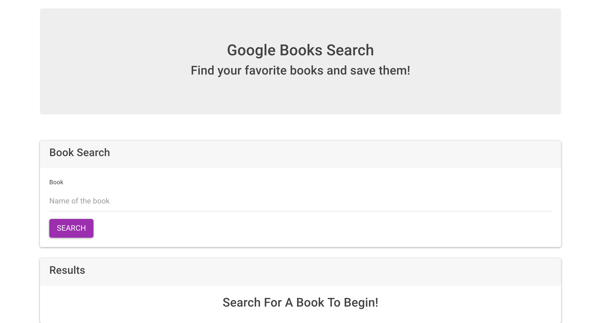
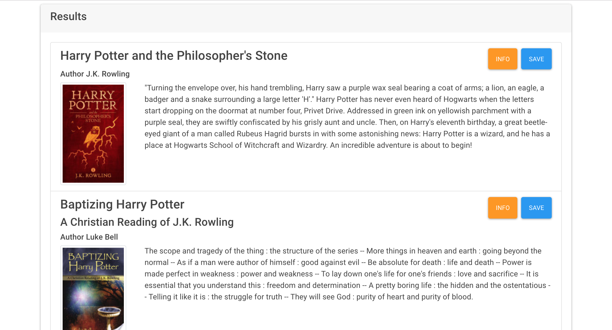
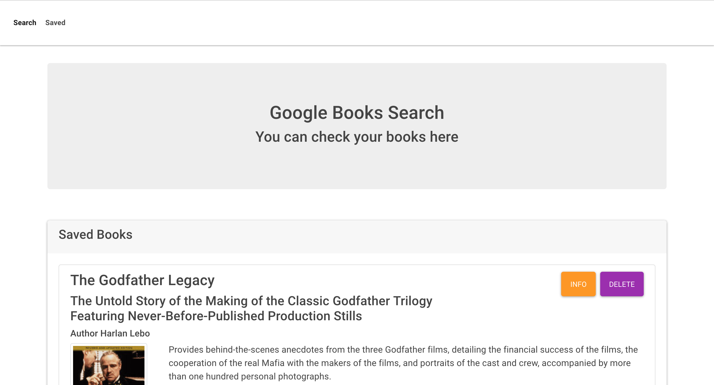

# Google-books-app Overview
This is an app for book lovers. It allows user to seach for books in Google Books database and save them for later reading.

## Landing Page

As soon as you open the page you can search for your favourite books by typing their names in "Book Search" section.

## Results

After the first step the app will return a list of books based on your search preferences. You can click "info" button and see more information on google books page or click "Save" and ad the book to your "Saved" list.

## Saved

You can check your entire list by clicking "Saved" at the top-left corner of the page.
The app will redirect you to the page where you'll see all of your books. You have options to delete them from your list or see more information by clicking "info" button.

## Tech I used
* React.js - Front end components
* Node.js - Server side code
* Mongo DB - Database
* Express - Server routing and management
* Google Books API - Access to google books database
* HTML5
* CSS 3
* Bootstrap 4
* Javascript

## Link to deployed App
* https://zguluzade-google-book-search.herokuapp.com/

## Start your own Google Books project

Feel free to copy this repo and create your own app.

After clonin the repo run: 

> npm install

> npm start

